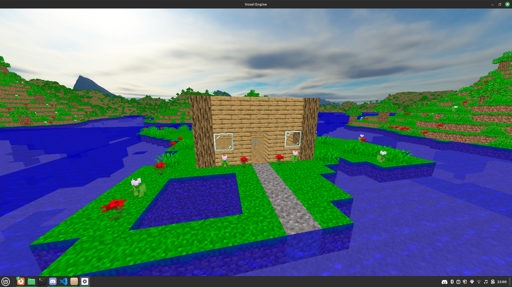
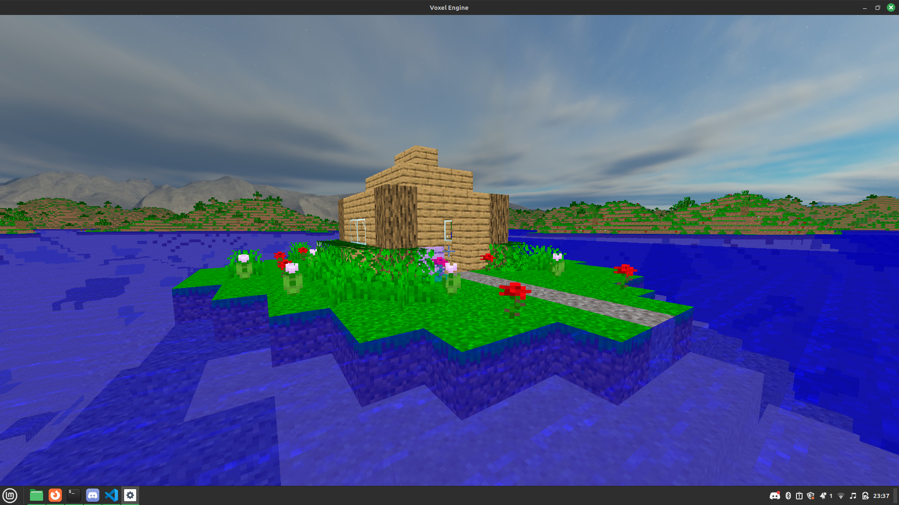

# Minecraft Clone (Craft++)

This is a minecraft clone written in C++ and GLSL. It's called **Craft++** because it abbreviates to C++ and I think that's quite funny. Here are some images of a few houses I have built:





### Warning

The chunk unloading process is not compressed at all, relatively small worlds can quickly reach gigabytes of disk space.

# Build Instructions

```
git clone https://github.com/Spacerulerwill/Minecraft-Clone.git --recursive
cd "Minecraft-Clone/tools/unix"
./configure.sh
./build.sh
```